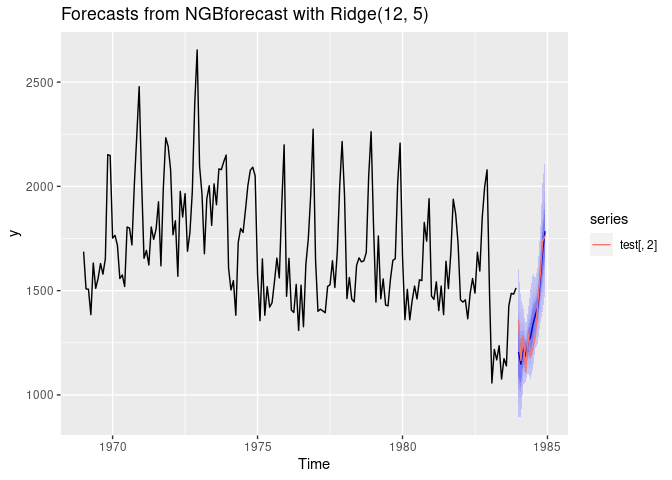

<!-- README.md is generated from README.Rmd. Please edit that file -->

# ngboostForecast

<!-- badges: start -->
<!-- badges: end -->

The goal of ngboostForecast is to provide a tools for probabilistic
forecasting by using Python’s ngboost for R users.

## Installation

You can install the released version of ngboostForecast from
[CRAN](https://CRAN.R-project.org) with:

``` r
install.packages("ngboostForecast")
```

And the development version from [GitHub](https://github.com/) with:

``` r
# install.packages("devtools")
devtools::install_github("Akai01/ngboostForecast")
```

## Example

This is a basic example which shows you how to solve a common problem:

``` r
library(ngboostForecast)

train = window(seatbelts, end = c(1983,12))

test = window(seatbelts, start = c(1984,1))

# without external variables with Ridge regression

model2 <- NGBforecast$new(Dist = Dist("LogNormal"),
                          Base = sklearner(module = "linear_model",
                                           class = "Ridge"),
                          Score = Scores("LogScore"),
                          natural_gradient = TRUE,
                          n_estimators = 200,
                          learning_rate =  0.1,
                          minibatch_frac = 1,
                          col_sample = 1,
                          verbose = TRUE,
                          verbose_eval = 5,
                          tol = 1e-5)

model2$fit(y = train[,2], 
          seasonal = TRUE, 
          max_lag = 12, 
          early_stopping_rounds = 10L)

fc <- model2$forecast(h = 12, level = c(99,95,90, 80, 70, 60), 
                      data_frame = FALSE)

forecast::autoplot(fc) + forecast::autolayer(test[,2])
```



# Tuning

## Set the parameters:

``` r
library(ngboostForecast)

dists <- list(Dist("Normal"))

base_learners <- list(sklearner(module = "tree", class = "DecisionTreeRegressor", 
                                max_depth = 1), 
                      sklearner(module = "tree", class = "DecisionTreeRegressor",
                                max_depth = 2), 
                      sklearner(module = "tree", class = "DecisionTreeRegressor",
                                max_depth = 3), 
                      sklearner(module = "tree", class = "DecisionTreeRegressor",
                                max_depth = 4), 
                      sklearner(module = "tree", class = "DecisionTreeRegressor",
                                max_depth = 5), 
                      sklearner(module = "tree", class = "DecisionTreeRegressor",
                                max_depth = 6), 
                      sklearner(module = "tree", class = "DecisionTreeRegressor",
                                max_depth = 7))

scores <-  list(Scores("LogScore"))

model <- NGBforecastCV$new(Dist = dists,
                           Base = base_learners,
                           Score = scores,
                           natural_gradient = TRUE,
                           n_estimators = list(10, 100),
                           learning_rate = list(0.1, 0.2),
                           minibatch_frac = list(0.1, 1),
                           col_sample = list(0.3),
                           verbose = FALSE,
                           verbose_eval = 100,
                           tol = 1e-5)
```

## Tune the model:

``` r
params <- model$get_params(y = AirPassengers,
                           seasonal = TRUE,
                           max_lag = 12,
                           xreg = NULL,
                           early_stopping_rounds = NULL,
                           n_splits = 4L)
```

## Best parameters:

``` r
params
#> $ngboost_best_params
#> $ngboost_best_params$Base
#> DecisionTreeRegressor(max_depth=3.0)
#> 
#> $ngboost_best_params$Dist
#> <class 'ngboost.distns.normal.Normal'>
#> 
#> $ngboost_best_params$Score
#> <class 'ngboost.scores.LogScore'>
#> 
#> $ngboost_best_params$col_sample
#> [1] 0.3
#> 
#> $ngboost_best_params$learning_rate
#> [1] 0.2
#> 
#> $ngboost_best_params$minibatch_frac
#> [1] 1
#> 
#> $ngboost_best_params$n_estimators
#> [1] 100
#> 
#> 
#> $ngb_forecast_params
#> $ngb_forecast_params$seasonal
#> [1] TRUE
#> 
#> $ngb_forecast_params$max_lag
#> [1] 12
#> 
#> $ngb_forecast_params$K
#> [1] 5
```
